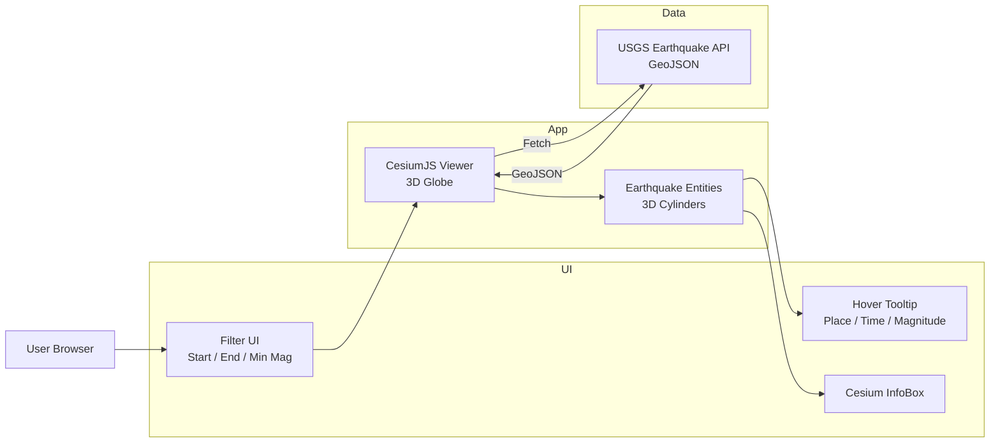
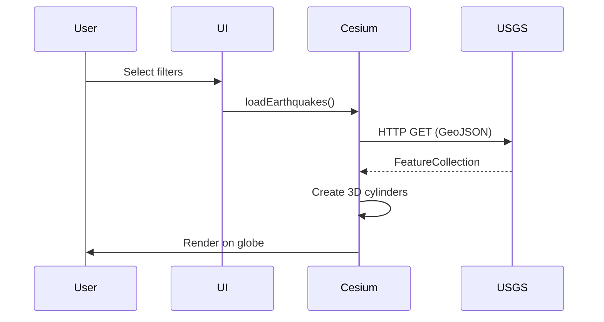
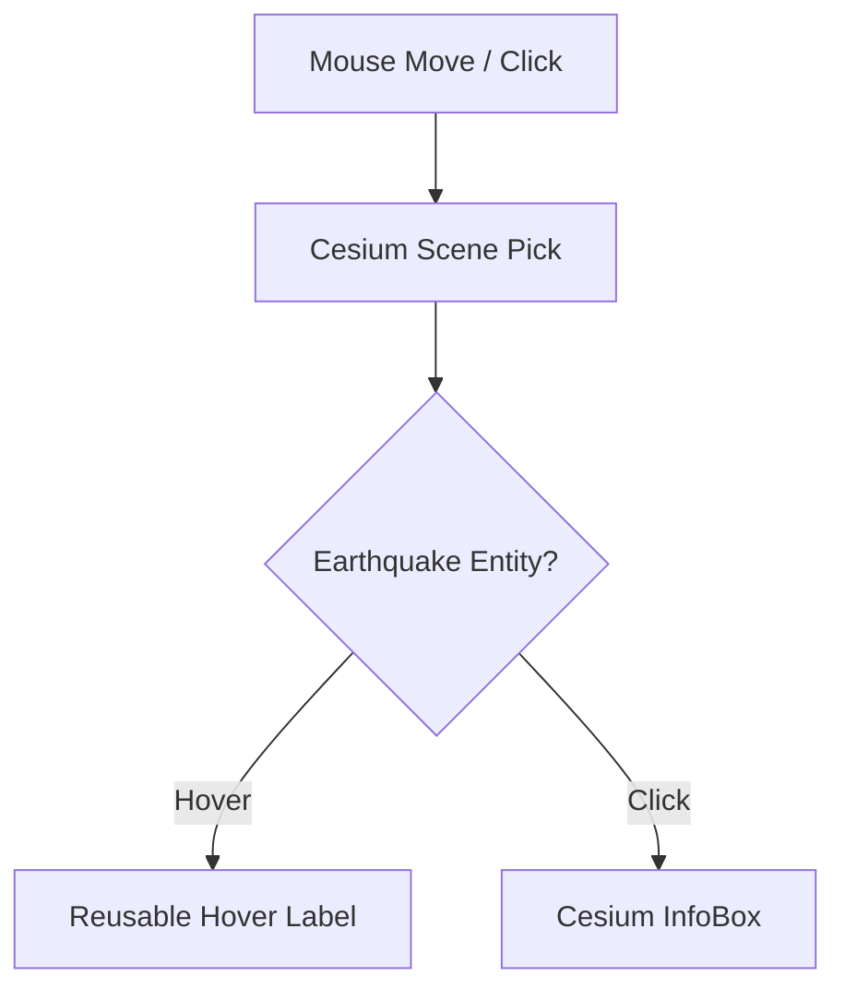
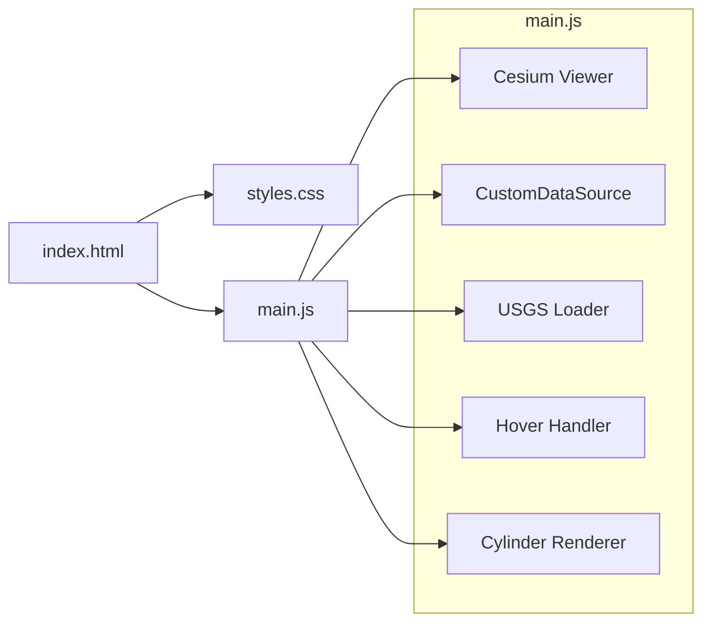

# 🌍 Interactive 3D Earthquake Visualization  
**CesiumJS + USGS Earthquake API**

## Overview

This project is a **web-based 3D geospatial visualization** that displays global earthquake activity on an interactive CesiumJS globe.

Earthquake data is retrieved in real time from the **USGS Earthquake GeoJSON REST API** and rendered as **magnitude-scaled 3D cylinder bars** at each epicenter.

The application allows users to filter earthquakes by time range and magnitude, explore events spatially, and interact with each earthquake via hover tooltips and detailed information panels.

## Overview


This project is a **web-based 3D geospatial visualization** that displays global earthquake activity on an interactive CesiumJS globe.

---

## ✨ Key Features

- 🌍 **3D Earth visualization** using CesiumJS
- 🔄 **Live data** from USGS Earthquake API (GeoJSON)
- 🎛️ User-controlled filters:
  - Start time
  - End time
  - Minimum magnitude
- 📊 **3D cylinder bars** scaled by earthquake magnitude
- 🎨 Color-coded visualization by magnitude
- 🖱️ **Mouse hover tooltip** (two lines):
  ```
  5 km WSW of Cobb, California
  2024-01-01 12:34:56 UTC | Mag 4.8 Mw
  ```
- 🖱️ Click an event to open Cesium InfoBox with details
- ⚡ Efficient rendering using a **single reusable hover label**

---

## 🏗️ Architecture Overview

### High-Level System Architecture



---

### Runtime Data Flow



---

### Interaction Model (Hover & Click)



---

## 🧩 Component Mapping



---

## 📁 Project Structure

```
earthquake-cesium/
├── index.html     # Application entry point
├── styles.css     # UI styling
└── main.js        # Cesium logic, API calls, rendering
```

---

## 🚀 Getting Started

### 1️⃣ Prerequisites

- A **Cesium Ion access token**  
  👉 https://cesium.com/ion/
- A local static web server (required for `fetch()`)

---

### 2️⃣ Configure Cesium Token

Edit `main.js`:

```js
Cesium.Ion.defaultAccessToken = "YOUR_CESIUM_ION_ACCESS_TOKEN";
```

---

### 3️⃣ Run Locally

Using Python:

```bash
cd earthquake-cesium
python -m http.server 8080
```

Open in browser:

```
http://localhost:8080
```

---

## 🔌 Data Source

**USGS Earthquake API**

Example endpoint:

```
https://earthquake.usgs.gov/fdsnws/event/1/query
  ?format=geojson
  &starttime=2024-01-01
  &endtime=2024-01-02
  &minmagnitude=4.5
```

Each earthquake feature includes:
- `place`
- `time`
- `magnitude`
- `coordinates`

---

## ⚙️ Design Decisions

- **Client-side only**  
  No backend or database required
- **Reusable hover label**  
  Prevents creating thousands of DOM or Cesium entities
- **Stateless data loading**  
  Every filter request fetches fresh data
- **Pure Cesium rendering**  
  No HTML overlays, better performance

---

## 📌 Limitations & Notes

- Large date ranges may return many events (performance impact)
- Depth is currently informational only (not extruded underground)
- Internet access required for Cesium terrain and USGS API

---

## 🔮 Possible Enhancements

- Depth-based subsurface visualization
- Magnitude legend overlay
- Clustering for dense datasets
- Time-lapse animation
- React / Angular integration
- WebGL performance tuning

---

## 🧠 Attribution

This project was **generated and iteratively refined using ChatGPT** as a coding assistant, with human-guided design and validation.

---

## 📜 License

This project uses public earthquake data from the **United States Geological Survey (USGS)**.  
CesiumJS is subject to its respective license.
