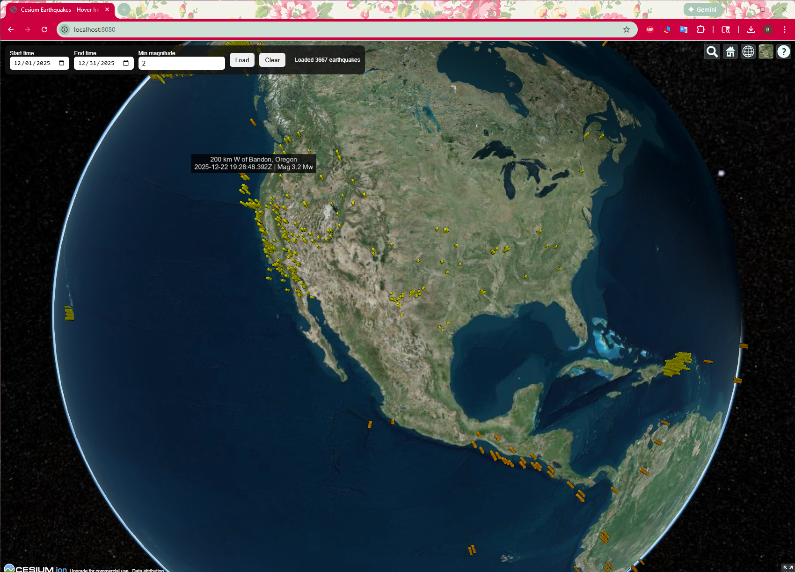
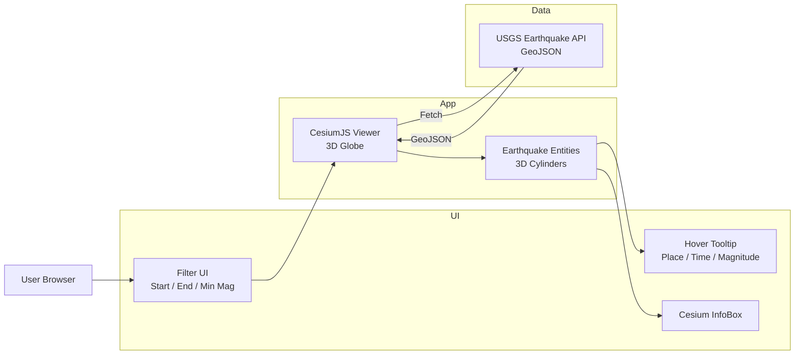
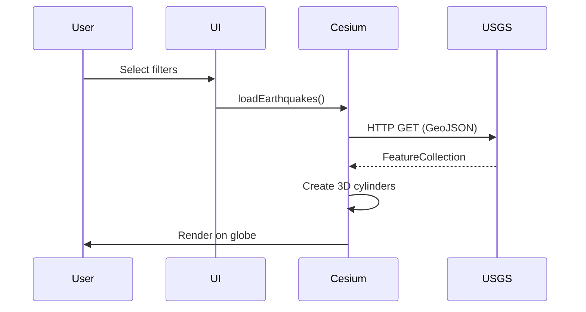
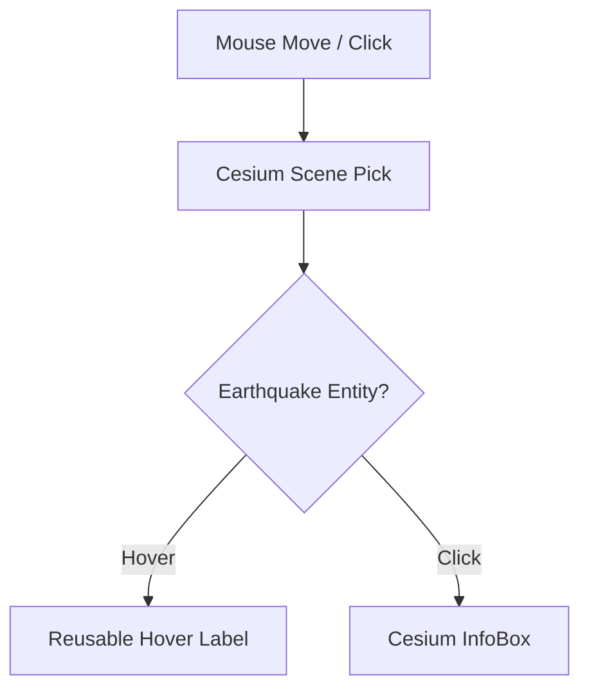
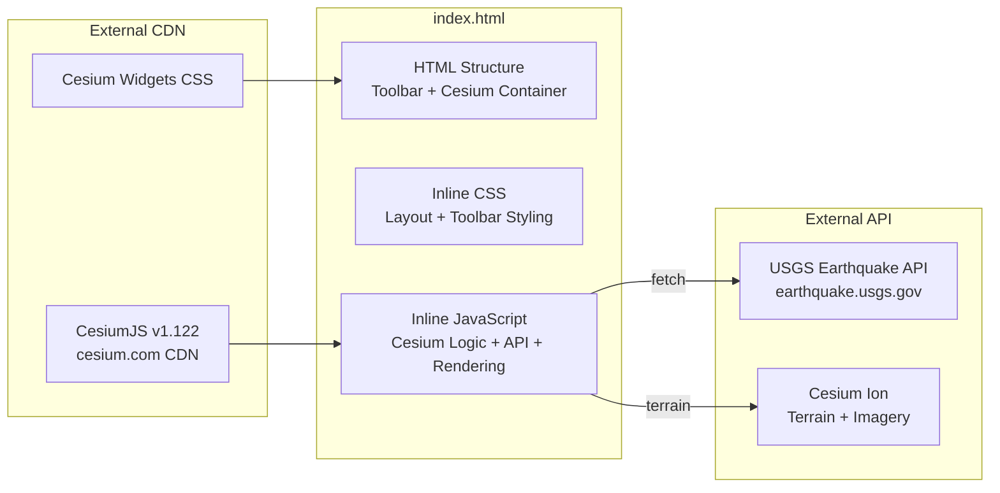

# 🌍 Interactive 3D Earthquake Visualization
**CesiumJS + USGS Earthquake API**

## Overview



This project is a **web-based 3D geospatial visualization** that displays global earthquake activity on an interactive CesiumJS globe.

Earthquake data is retrieved in real time from the **USGS Earthquake GeoJSON REST API** and rendered as **magnitude-scaled 3D cylinder bars** at each epicenter.

The application allows users to filter earthquakes by time range and magnitude, explore events spatially, and interact with each earthquake via hover tooltips and detailed information panels.

---

## ✨ Key Features

- 🌍 **3D Earth visualization** using CesiumJS
- 🔄 **Live data** from USGS Earthquake API (GeoJSON)
- 🎛️ User-controlled filters:
  - Start time
  - End time
  - Minimum magnitude
- 📊 **3D cylinder bars** scaled by earthquake magnitude
- 🎨 Color-coded visualization by magnitude
- 🖱️ **Mouse hover tooltip** (two lines):
  ```
  5 km WSW of Cobb, California
  2024-01-01 12:34:56 UTC | Mag 4.8 Mw
  ```
- 🖱️ Click an event to open Cesium InfoBox with details
- ⚡ Efficient rendering using a **single reusable hover label**

---

## 🏗️ Architecture Overview

### High-Level System Architecture



---

### Runtime Data Flow



---

### Interaction Model (Hover & Click)



---

## 🧩 Single-File Architecture

All HTML, CSS, and JavaScript are combined into a **single `index.html`** file for simple deployment.



---

## 📁 Project Structure

```
earthquake-cesium/
├── index.html                                   # Single-file app (HTML + CSS + JS)
├── README.md                                    # This documentation
├── images/
│   └── overview.png                             # Screenshot for README
└── AWS/
    ├── ch3-key.pem                              # SSH key pair
    ├── deployment-guide.md                      # AWS deployment steps
    ├── earthquakes-vpc-architecture.yaml        # CloudFormation template
    ├── earthquakes-vpc-detailed-architecture.drawio  # Architecture diagram
    └── index.html                               # Copy of app for SCP deploy
```

### What's inside `index.html`

| Section | Description |
|---------|-------------|
| `<style>` | Toolbar layout, full-screen Cesium container |
| `<div id="toolbar">` | Filter controls (date range, magnitude, buttons) |
| `<div id="cesiumContainer">` | CesiumJS 3D globe viewport |
| `<script>` | Cesium viewer setup, USGS API fetch, cylinder rendering, hover handler |

---

## 🚀 Getting Started

### 1️⃣ Prerequisites

- A **Cesium Ion access token** (free — see below)
- A local static web server (required for `fetch()`)

---

### 2️⃣ Get a Cesium Ion Access Token (Google Sign-In)

Cesium Ion provides free access to 3D terrain, satellite imagery, and tiling services. You can sign up with your **Google email** in under 2 minutes.

#### Step 1 — Go to Cesium Ion Sign Up

Open your browser and navigate to:

```
https://ion.cesium.com/signup/
```

#### Step 2 — Sign in with Google

1. Click the **"Sign in with Google"** button
2. Select your **Google account** (or enter your Gmail address)
3. Authorize Cesium to access your basic profile info
4. You'll be redirected to the **Cesium Ion Dashboard**

> 💡 You can also sign in with **GitHub** or **Epic Games** accounts.

#### Step 3 — Copy Your Access Token

1. In the Cesium Ion Dashboard, click **"Access Tokens"** in the left sidebar
   - Or go directly to: `https://ion.cesium.com/tokens`
2. You'll see a **default token** already created for your account
3. Click the **📋 Copy** button next to the default token

Your token will look like this:

```
eyJhbGciOiJIUzI1NiIsInR5cCI6IkpXVCJ9.eyJqdGkiOiI4ODNk...
```

#### Step 4 — Add the Token to `index.html`

Open `index.html` and replace the token value:

```js
Cesium.Ion.defaultAccessToken = "PASTE_YOUR_TOKEN_HERE";
```

> ⚠️ **Best Practice**: For production apps, create a **new token** instead of using the default one. Click **"Create Token"** on the Access Tokens page, give it a name (e.g., `earthquake-app`), and select only the scopes you need (`assets:read`).

---

### 3️⃣ Run Locally

Using Python:

```bash
cd earthquake-cesium
python -m http.server 8080
```

Using VS Code Live Server:

1. Open the folder in VS Code
2. Right-click `index.html`
3. Select **"Open with Live Server"**

Open in browser:

```
http://localhost:8080
```

---

## ☁️ AWS Deployment

This project includes a complete **AWS CloudFormation** setup for deploying to an EC2 instance.

### AWS Architecture

```
User (Browser / SSH)
       │
       ▼
  [ Internet ] → [ Earthquake-IGW ] → [ Virtual Router ] → [ Earthquake-Public-EC2 ]
                                            │                        │
                                     [ Earthquake-Public-RT ]  [ Earthquake-EIP ]
                                     0.0.0.0/0 → IGW
                                     10.0.0.0/16 → local
```

### AWS Resources Created

| Resource | Name | Details |
|----------|------|---------|
| VPC | Earthquake-VPC | CIDR: 10.0.0.0/16 |
| Subnet | Earthquake-Public-Subnet | CIDR: 10.0.1.0/24, AZ-a |
| Internet Gateway | Earthquake-IGW | Attached to Earthquake-VPC |
| Route Table | Earthquake-Public-RT | 0.0.0.0/0 → IGW |
| Security Group | Earthquake-Public-SG | Inbound: SSH (22), HTTP (80) |
| EC2 Instance | Earthquake-Public-EC2 | t2.micro, Amazon Linux 2023, Apache |
| Elastic IP | Earthquake-EIP | Static public IP |

### Quick Deploy

```bash
cd earthquake-cesium/AWS

# 1. Create stack
aws cloudformation create-stack \
  --stack-name earthquake-vpc-stack \
  --template-body file://earthquakes-vpc-architecture.yaml \
  --parameters ParameterKey=KeyPairName,ParameterValue=ch3-key

# 2. Wait for completion
aws cloudformation wait stack-create-complete --stack-name earthquake-vpc-stack

# 3. Get Elastic IP
EIP=$(aws cloudformation describe-stacks \
  --stack-name earthquake-vpc-stack \
  --query "Stacks[0].Outputs[?OutputKey=='ElasticIP'].OutputValue" \
  --output text)

# 4. Deploy index.html via SCP
scp -i ch3-key.pem index.html ec2-user@$EIP:/tmp/ && \
ssh -i ch3-key.pem ec2-user@$EIP "\
  sudo cp /tmp/index.html /var/www/html/index.html && \
  sudo systemctl restart httpd"

# 5. Open in browser
echo "http://$EIP"
```

### Clean Up

```bash
aws cloudformation delete-stack --stack-name earthquake-vpc-stack
aws cloudformation wait stack-delete-complete --stack-name earthquake-vpc-stack
```

> 📘 See `AWS/deployment-guide.md` for detailed step-by-step instructions and troubleshooting.

---

## 🔌 Data Source

**USGS Earthquake API**

Example endpoint:

```
https://earthquake.usgs.gov/fdsnws/event/1/query
  ?format=geojson
  &starttime=2024-01-01
  &endtime=2024-01-02
  &minmagnitude=4.5
```

Each earthquake feature includes:
- `place`
- `time`
- `magnitude`
- `coordinates`

---

## ⚙️ Design Decisions

- **Single-file architecture**
  HTML, CSS, and JS in one `index.html` — no build tools, no bundler, easy to deploy via SCP
- **Client-side only**
  No backend or database required
- **Reusable hover label**
  Prevents creating thousands of DOM or Cesium entities
- **Stateless data loading**
  Every filter request fetches fresh data
- **Pure Cesium rendering**
  No HTML overlays, better performance
- **CesiumJS loaded from CDN**
  No local Cesium installation needed

---

## 🎮 Controls

- **Start time** → Filter earthquakes from this date
- **End time** → Filter earthquakes until this date
- **Min magnitude** → Only show earthquakes ≥ this value
- **Load** → Fetch and display earthquakes
- **Clear** → Remove all earthquake markers
- **Mouse Drag** → Rotate the globe
- **Mouse Wheel** → Zoom in / out
- **Hover** → See earthquake tooltip
- **Click** → Open Cesium InfoBox with details

---

## 📌 Limitations & Notes

- Large date ranges may return many events (performance impact)
- Depth is currently informational only (not extruded underground)
- Internet access required for Cesium terrain, imagery, and USGS API

---

## 🔮 Possible Enhancements

- Depth-based subsurface visualization
- Magnitude legend overlay
- Clustering for dense datasets
- Time-lapse animation
- React / Angular integration
- WebGL performance tuning

---

## 🧠 Attribution

This project was **generated and iteratively refined using AI** as a coding assistant, with human-guided design and validation.

---

## 📜 License

This project uses public earthquake data from the **United States Geological Survey (USGS)**.
CesiumJS is subject to its respective license.
