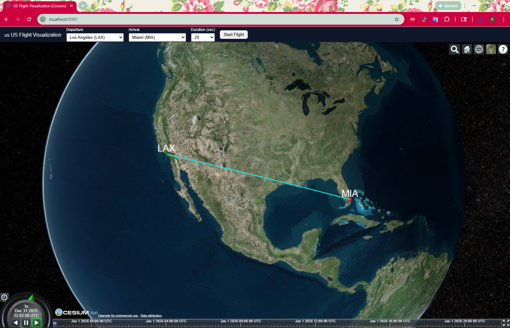

# 🇺🇸 Cesium US Flight Visualization (Single Route Demo)



A lightweight **CesiumJS 3D globe visualization** that displays a **single commercial flight route** between **major U.S. international airports**, animated in **10–30 seconds** using a **3D cylinder** to represent an airplane.

This project is designed as a **clean, stable starter architecture** for:
- flight route visualization
- timeline-based animation (similar to earthquake replay)
- training / demo / analytics use cases

No 3D model files (`.glb`) are required.

---

## ✨ Features

- 🌍 CesiumJS 3D Earth
- 🇺🇸 10 major U.S. international airports
- ✈️ Single flight route (departure → arrival)
- 🟡 Airplane represented by a **3D cylinder**
- ⏱ Adjustable flight duration (10 / 20 / 30 seconds)
- 🧭 Airport markers + route polyline
- 🔐 Secure SerpAPI usage (backend only)

---

## 🏗 Architecture Overview

```
Browser (Frontend)
  └── index.html
  └── app.js (Cesium visualization)
  └── styles.css
        │
        │  HTTP (fetch)
        ▼
Node.js Backend (Express)
  └── /api/flights
        │
        │  Private API request
        ▼
SerpAPI (Google Flights)
```

---

## 📁 Project Structure

```
project-root/
├── backend/
│   └── server.js
│
├── frontend/
│   ├── index.html
│   ├── app.js
│   └── styles.css
│
└── README.md
```

---

## 🔐 Environment Variables

### SerpAPI (Backend only)

**Windows (PowerShell)**
```
$env:SERPAPI_KEY="your_serpapi_private_key"
```

**macOS / Linux**
```
export SERPAPI_KEY="your_serpapi_private_key"
```

> ⚠️ Never put this key in frontend JavaScript.

---

### Cesium Ion Token (Frontend)

Edit `app.js`:

```
Cesium.Ion.defaultAccessToken = "YOUR_CESIUM_ION_TOKEN";
```

Get a free token from:
https://cesium.com/ion/

---

## ▶ How to Run the Backend

```
cd backend
npm install express node-fetch cors
node server.js
```

Test:
```
http://localhost:3000/api/flights?dep=LAX&arr=JFK&date=2026-01-01
```

---

## ▶ How to Run the Frontend

**VS Code Live Server**
- Open `frontend/index.html`
- Right-click → Open with Live Server

**or**

```
cd frontend
python -m http.server 8080
```

Open:
```
http://localhost:8080
```

---

## 🧭 Supported Airports

LAX, JFK, SFO, ORD, DFW, ATL, SEA, DEN, MIA, BOS

---

## 📸 Screenshot

After running the app, add a screenshot here:

```
docs/screenshot.png
```

```

```

---

## 🚀 Next Enhancements

- Curved flight arcs
- Climb / cruise / descent
- Multiple flights
- Play / pause controls
- Real ADS-B integration
