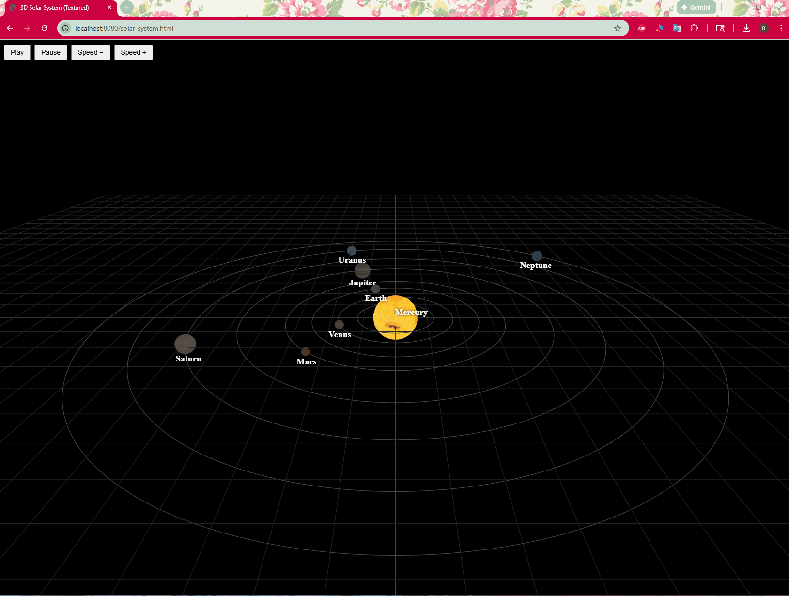

# 🌌 Solar System Explorer (3D)

A lightweight **frontend-only 3D Solar System visualization** that shows the Sun and planets orbiting in space.

Built with **pure HTML, CSS, and JavaScript** using **Three.js**.  
No Node.js, no build tools, no frameworks.

Designed for **Grade 8–10 students** learning visual programming and basic astronomy concepts.

---

## 📸 Overview

**Solar System Explorer** allows students to:

- View the Sun and planets in a 3D space
- See planets move along elliptical orbits
- Control orbit speed (slow down / speed up)
- Pause and resume planetary motion
- Learn planet names through labels
- Explore 3D scenes using mouse controls

This project is ideal for:
- Learning 3D thinking
- Understanding planetary motion
- Visual science exploration
- Vibe coding demos 🎧

---

## 📁 Project Structure

solar-system-v1/
│
├─ index.html
├─ textures/
│ ├─ Sun.png
│ ├─ Mercury.png
│ ├─ Venus.png
│ ├─ Earth.png
│ ├─ Mars.png
│ ├─ Jupiter.png
│ ├─ Saturn.png
│ ├─ Uranus.png
│ └─ Neptune.png
└─ images/
└─ overview.png

---

## ▶️ How to Run

### Option 1: Open Directly
1. Download or clone the project
2. Open `index.html` in your web browser

### Option 2: VS Code Live Server (Recommended)
1. Open the folder in VS Code
2. Right-click `index.html`
3. Select **“Open with Live Server”**

No installation or build steps are required.

---

## 🧠 Architecture

Browser
|
|-- index.html
|-- Three.js (ES Module)
|-- OrbitControls
|-- CSS2DRenderer (labels)
|
Local Texture Images

---

## 🌍 What Students Learn

### Computer Science Concepts
- 3D coordinate systems (X, Y, Z)
- Animation loops (`requestAnimationFrame`)
- Event handling (buttons)
- Separation of data and logic
- Basic rendering pipeline

### Science Concepts
- Planetary orbits
- Elliptical motion
- Relative distance and scale
- The Solar System structure

---

## 🪐 Planet Textures

This project uses **local planet texture images** instead of online URLs  
to ensure reliable loading in classrooms and school networks.

### 📥 How to Download Textures (Manual)

Planet textures can be downloaded from:

👉 https://planet-texture-maps.fandom.com/wiki/Planet_Texture_Maps_Wiki

#### Steps
1. Open the site and choose a planet
2. Scroll to find the texture image
3. Right-click the image → **Save image as…**
4. Save it into the `textures/` folder
5. Rename the file to match the code (example: `Mars.png`)

Using local files avoids:
- Network errors
- CORS issues
- Proxy or firewall problems

---

## 🎮 Controls

- **Mouse Drag** → Rotate the view
- **Mouse Wheel** → Zoom in / out
- **Play** → Start planet motion
- **Pause** → Stop planet motion
- **Speed − / Speed +** → Control orbit speed

---

## 🚀 Possible Enhancements

Students can extend the project by adding:

- Saturn rings
- Planet self-rotation
- Moons (Earth’s Moon, Jupiter’s moons)
- Planet information panels
- Time scale slider
- Background stars
- Labels toggle (on / off)

---

## 🎯 Educational Goals (Grade 8–10)

By completing this project, students will:

- Understand basic 3D programming concepts
- Connect coding with science learning
- Gain confidence using JavaScript
- Learn how simulations are built
- Practice problem-solving and creativity

---

## 📄 License

MIT License — free to use for **learning, classroom demos, and education**.
