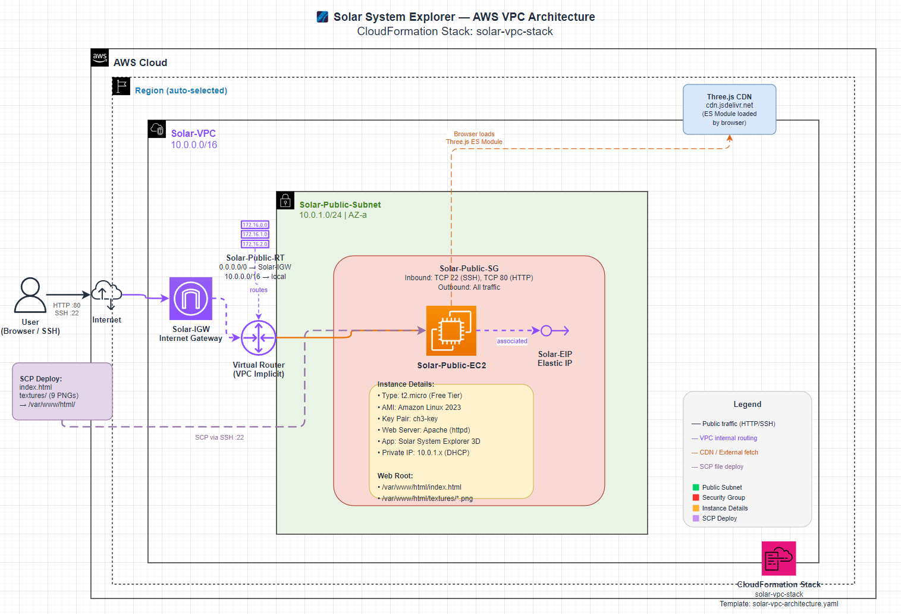

# 🌍🌌🎬🏆 Vibe Coding Projects Collection

This repository contains **three creative frontend projects** built using **vibe coding** principles:
fast iteration, visual feedback, real-world data, and fun exploration.

Each project emphasizes **learning by building**, using **HTML, CSS, JavaScript**, and **3D visualization**.

---

# 🎧 Vibe Coding Syllabus (7 Sessions)

This 7-session course introduces students to **Vibe Coding** —  
a visual, hands-on way to learn web development by building real projects
with **HTML, CSS, JavaScript, REST APIs, and 3D visualization**.

Students will build **three complete projects** and learn how to extend them
with their own creative ideas.

---

## 🧠 What Is Vibe Coding?

**Vibe Coding** means:

- Build first, understand while building
- Focus on visuals and interaction
- Use real-world data
- Keep things simple and fun
- Learn by experimenting

---

## 🗓 Session Overview

| Session | Topic |
|------|------|
| 1 | Vibe Coding & Web Basics |
| 2 | HTML / CSS / JavaScript 101 |
| 3 | VS Code & Local Web Server |
| 4 | Movie Actor Explorer Project |
| 5 | Solar System 3D Project |
| 6 | Earthquake Cesium Project |
| 7 | Extending Features & GitHub Basics |

---

## 🟢 Session 1: Vibe Coding & Web Basics

### Goals
- Understand what Vibe Coding is
- Learn how the web works
- Explore all projects

### Topics
- What are HTML, CSS, and JavaScript?
- How browsers load web pages
- Frontend vs Backend (conceptual)
- REST API basics (high-level)

### Activities
- Open a simple HTML file
- Change text and refresh the browser
- Explore demo projects

---

## 🟢 Session 2: HTML / CSS / JavaScript 101

### Goals
- Build basic web pages
- Understand structure, style, and behavior

### Topics
- HTML elements (`div`, `img`, `h1`)
- CSS basics (colors, fonts, layout)
- JavaScript fundamentals
- Click events (`onclick`)

### Activities
- Create a card layout
- Style cards with CSS
- Add JavaScript click behavior

---

## 🟢 Session 3: VS Code & Local Web Server

### Goals
- Use VS Code confidently
- Run projects locally

### Topics
- VS Code interface
- Project folder structure
- Live Server extension
- Browser DevTools basics

### Activities
- Install VS Code
- Install Live Server
- Run a project locally
- Inspect HTML and JavaScript in DevTools

---

## 🟢 Session 4: Movie Actor Explorer Project

### Goals
- Build a REST API–driven project
- Understand `fetch()` and JSON

### Topics
- REST API structure
- Fetching data from APIs
- Parsing JSON
- Dynamic DOM updates

### Activities
- Build actor cards
- Click actor → load movies
- Show posters and descriptions
- Add new actors

### Project
- `movie-actor-explorer-v1`

---

## 🟢 Session 5: Solar System 3D Project

### Goals
- Learn 3D visualization concepts
- Understand orbits and motion

### Topics
- Three.js basics
- 3D coordinate systems
- Orbits and animation loops
- Texture mapping

### Activities
- Render the Sun and planets
- Animate planetary orbits
- Add labels and controls
- Adjust speed and camera view

### Project
- `solar-system-v1`

---

## 🟢 Session 6: Earthquake Cesium Project

### Goals
- Learn 3D map visualization
- Understand geographic coordinates

### Topics
- CesiumJS fundamentals
- Latitude and longitude
- 3D globe navigation
- Visualizing scientific data

### Activities
- Plot earthquakes on Earth
- Color earthquakes by magnitude
- Explore time-based data

### Project
- `earthquakes-v1`

---

## 🟢 Session 7: Extending Features & GitHub Basics

### Goals
- Extend projects creatively
- Learn GitHub fundamentals

### Topics
- Adding new features
- Refactoring code
- GitHub repositories and commits
   - Initialize Git
```
   git init
```
   - Check:
```
   git status
```
   - Set the origin remote
   This is the exact command VS Code runs behind the scenes:

   git remote add origin https://github.com/[git hub id]/[repository name].git
```
   git remote add origin https://github.com/benchvue/GeoGebra.git
```
   - First commit
```
   git add .
   git commit -m "Initial commit"
```
   Push to GitHub
```
   git push
```

- Writing README files
- Sharing projects online

### Activities
- Add a new feature to any project
- Create a GitHub repository
- Commit code
- Write a README
- Share project links

---

## 🎬 movie-actor-explorer-v1  
**Movie Actor Explorer**


**Description**  
A card-based app to explore famous movie actors and their movies using a public REST API.

**Vibe Coding Focus**
- Card-based UI
- Click → detail interaction
- Entertainment data

**Key Learning**
- REST API usage
- JSON parsing
- Dynamic UI updates

---

## 🌌 solar-system-v1  
**3D Solar System Visualization**


**Description**  
A 3D visualization of the solar system built with **Three.js**, showing the Sun and planets orbiting in space.

**Vibe Coding Focus**
- 3D thinking and spatial reasoning
- Animation and motion
- Visual learning through simulation

**Key Learning**
- Three.js fundamentals
- Animation loops
- Texture mapping
- Coordinate systems

---

## 📥 How to Download Planet Textures (Manual)

This Solar System project uses planet surface textures that you can download manually from the **Planet Texture Maps Wiki**.

### Step-by-Step Instructions

1. Open the texture source site in your browser:

   👉 https://planet-texture-maps.fandom.com/wiki/Planet_Texture_Maps_Wiki

2. Use the navigation menu or search box to find a planet.

3. On the planet page, scroll until you see the texture image.

4. **Right-click** on the texture preview and choose:

---

## ☁️ AWS Deployment



Deploy the Solar System 3D project to AWS using CloudFormation in **5 commands**.

### Resources Created

| Resource | Name | Details |
|----------|------|---------|
| VPC | Solar-VPC | CIDR: 10.0.0.0/16 |
| Subnet | Solar-Public-Subnet | CIDR: 10.0.1.0/24, AZ-a |
| Internet Gateway | Solar-IGW | Attached to Solar-VPC |
| Route Table | Solar-Public-RT | 0.0.0.0/0 → IGW, 10.0.0.0/16 → local |
| Security Group | Solar-Public-SG | Inbound: SSH (22), HTTP (80) |
| EC2 Instance | Solar-Public-EC2 | t2.micro, Amazon Linux 2023, Apache |
| Elastic IP | Solar-EIP | Static public IP for EC2 |

### Deploy in 5 Commands

Navigate to the AWS folder and run:
```bash
# 1. Create CloudFormation stack
aws cloudformation create-stack \
  --stack-name solar-vpc-stack \
  --template-body file://solar-vpc-architecture.yaml \
  --parameters \
    ParameterKey=KeyPairName,ParameterValue=ch3-key \
    ParameterKey=SSHLocation,ParameterValue=0.0.0.0/0

# 2. Wait for stack creation
aws cloudformation wait stack-create-complete --stack-name solar-vpc-stack

# 3. Get Elastic IP
EIP=$(aws cloudformation describe-stacks \
  --stack-name solar-vpc-stack \
  --query "Stacks[0].Outputs[?OutputKey=='ElasticIP'].OutputValue" \
  --output text)

# 4. Upload app files
scp -i ch3-key.pem index.html ec2-user@$EIP:/tmp/ && \
scp -i ch3-key.pem -r textures ec2-user@$EIP:/tmp/ && \
ssh -i ch3-key.pem ec2-user@$EIP "\
  sudo cp /tmp/index.html /var/www/html/index.html && \
  sudo cp -r /tmp/textures/* /var/www/html/textures/ && \
  sudo systemctl restart httpd"

# 5. Open in browser
echo "Visit: http://$EIP"
```

**📖 Full deployment guide:** See `solar-system-v2/AWS/deployment-guide.md` for detailed instructions, troubleshooting, and cleanup steps.

---

## 🌍 earthquakes-v1  
**Earthquake 3D Cesium Visualization**


**Description**  
A 3D globe visualization displaying recent earthquake activity using **CesiumJS**.

**Vibe Coding Focus**
- Real-world geospatial data
- 3D globe visualization
- Visual learning through motion and scale

**Key Learning**
- CesiumJS basics
- Coordinates and mapping
- Scientific data visualization

---

## 🎯 Overall Vibe Coding Philosophy

All projects follow these principles:

- Build fast, learn fast
- Visual-first design
- Use real-world data
- Learn through interaction
- No heavy frameworks

Ideal for:
- Learning frontend development
- Teaching middle school, high school, or college students
- Rapid prototyping
- Portfolio projects

---

## 📄 License

All projects are free to use for **learning, demos, and education**.