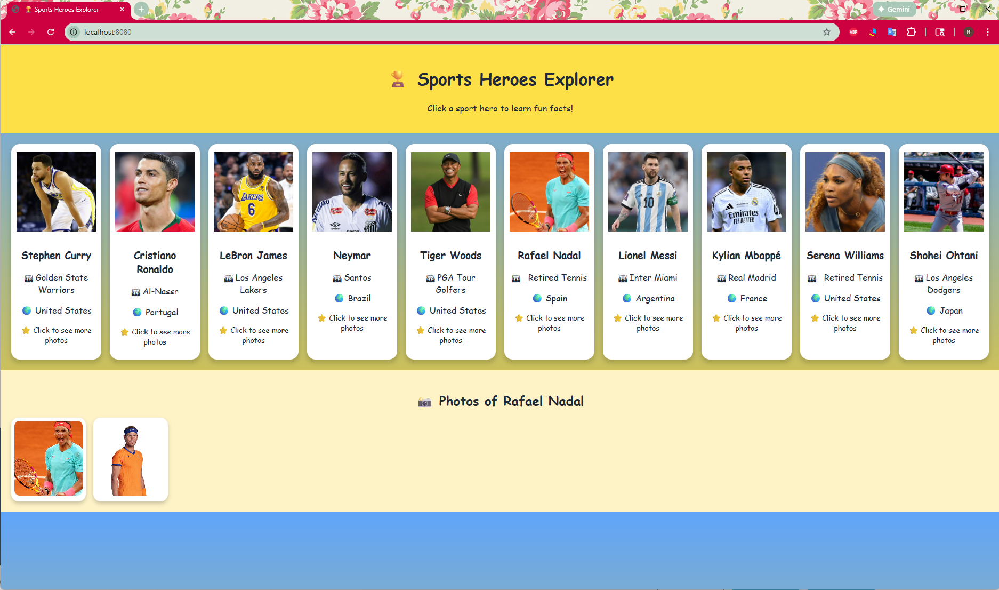

# 🏆 Sports Heroes Explorer (Student Project)



Sports Heroes Explorer is a fun, visual web project designed to help **high school students** learn the basics of **HTML, CSS, JavaScript, and REST APIs** by exploring famous sports stars.

This project uses **only frontend technologies** and a **free public sports API**, so it is easy to run, safe to share, and perfect for learning.

---

## 🎯 Overview

In this project, students build a website that:

- Shows famous sports stars as **cards**
- Lets users **click a star** to see more photos
- Uses a **real REST API** to load data from the internet
- Updates the page dynamically **without reloading**
- Uses only:
  - HTML
  - CSS
  - JavaScript
- Does **not** require:
  - Node.js
  - Frameworks
  - API keys or tokens

---

## 🧑‍🎓 Learning Goals

By completing this project, students will learn:

- How web pages are structured with **HTML**
- How to design layouts using **CSS Grid**
- How to handle user actions with **JavaScript**
- How to call a **REST API** using `fetch()`
- How to read and use **JSON data**
- How modern interactive websites work

---

## 📁 Project Structure
```
sports-heroes-explorer/
│
├─ index.html # Page structure
├─ css/
│ └─ style.css # Styling and layout
└─ js/
└─ app.js # JavaScript logic and API calls
```


Each file has a clear role, which is a good software design practice.

---

## 🧠 Design Architecture

```
User clicks a sports star
↓
JavaScript handles the click event
↓
REST API request is sent
↓
API returns JSON data
↓
JavaScript updates the page content
```


The page does not reload.  
JavaScript updates the content dynamically, just like modern websites.

---

## 🌍 REST API for Sports Stars

This project uses the **TheSportsDB** API.

- Website: https://www.thesportsdb.com
- Cost: Free
- API Key: Not required

The API provides:
- Player names
- Sports types
- Countries
- Teams
- Photos

---

## 🔗 REST API Example

### Example Request (Search a Sports Star)

https://www.thesportsdb.com/api/v1/json/3/searchplayers.php?p=Lionel%20Messi


### Example JSON Response (Simplified)

```json
{
  "player": [
    {
      "strPlayer": "Lionel Messi",
      "strSport": "Soccer",
      "strNationality": "Argentina",
      "strTeam": "Inter Miami",
      "strThumb": "https://image-url.jpg"
    }
  ]
}
```

🧩 How the App Uses the API Data

In JavaScript, the JSON fields are used like this:
```
player.strPlayer       // Player name
player.strSport        // Sport type
player.strNationality  // Country
player.strTeam         // Team name
player.strThumb        // Image URL
```

This helps students understand how real-world data is used in code.

▶️ How to Run the Project

Download the project folder

Open index.html in a web browser
(Chrome, Edge, Firefox all work)

Optional:

Use VS Code Live Server for easier testing

No installation or setup is required.

🛡️ Safety for Students

No login required

No passwords

No personal data

No API keys

No backend server

This makes the project safe for:

Classrooms

Coding clubs

STEM programs

Self-study

🚀 Extension Ideas for Students

Add more sports stars

Add emojis for different sports

Highlight the selected star

Add animations to cards

Create a quiz:

“Which sport does this star play?”

📄 License

Free to use for educational and learning purposes.